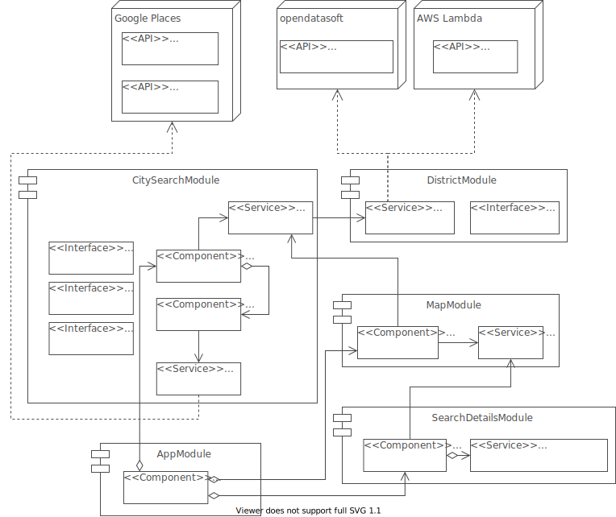

# Crimeview | Stadt- Landkreiskriminalität

This app analyses a route based on a Polygon, Line or Radius for 1 - 3 german cities and displays all districts <i>(de: Stadt- Landkreise)</i> with their respective crime rate on it.

<i>Crime rate</i> == Number of offences per 100.000 inhabitants.

  

## Architecture

### Building block view

  

## Data sources

<ul>
    <li><a target_blank href="https://public.opendatasoft.com/explore/dataset/georef-germany-kreis/information">Opendatasoft</a><strong> - Geojson of districts 💗</strong></li>
    <li><a target_blank href="https://cloud.google.com/maps-platform/places">Google Places</a> - City predictions and details</li>
    <li><a target_blank href="https://www.bka.de/DE/AktuelleInformationen/StatistikenLagebilder/PolizeilicheKriminalstatistik/pks_node.html">Bundeskriminalamt</a> - District crime statistics</li>
</ul>
